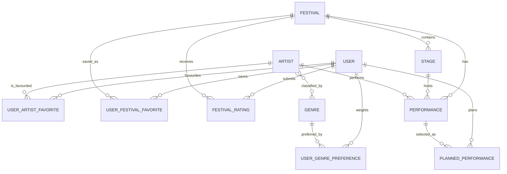
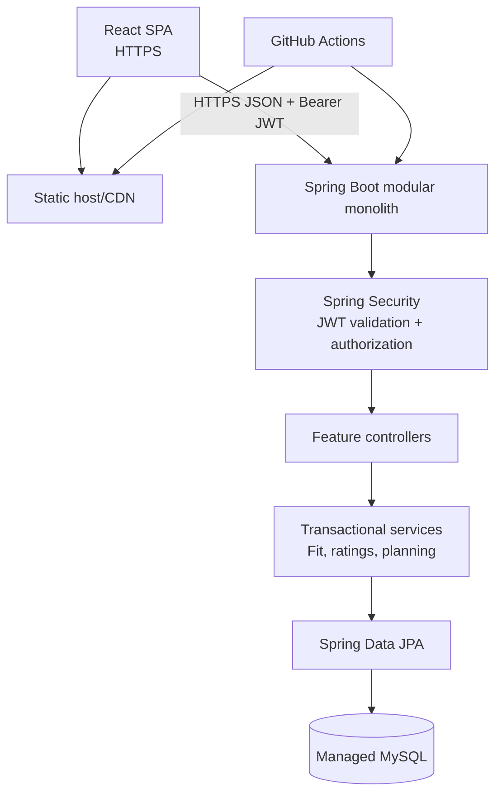

# FestivalLineupTracker: Festival Decision Engine

## Status and product boundary

**Approved design.** FestivalLineupTracker is a production-style web application for music fans deciding whether a festival is worth attending and how to navigate it once set times are known.

It answers two connected questions:

1. **Is this festival worth it for me?** An explainable, deterministic **Festival Fit** score (0–100) uses explicit favourite artists and genre preferences.
2. **What should I see when I am there?** A personal itinerary detects overlapping planned sets and uses the same preference model to offer a transparent recommendation.

The first release is a React single-page application and Spring Boot modular monolith, backed by MySQL. Festival, lineup, stage, and set-time data is admin-curated. The live demo uses roughly 10–20 realistic, richly populated sample festivals; an external catalogue/import pipeline is intentionally out of scope.

The two core pillars are:

- Personalized lineup intelligence: onboarding, preferences, discovery, Festival Fit, and explainable analytics.
- Conflict-aware schedule planning: stages, performances, personal plans, and clash recommendations.

Community lineup ratings complement, but never influence, a user's Festival Fit or clash recommendation.

### Explicit exclusions

Do not build tickets, payment, maps, push notifications, chat/follows/posts, user-submitted festival data, external ingestion, machine learning, native apps, microservices, caches/queues, or Kubernetes in the initial product. Artist-to-artist discovery and trending signals are later candidates only after the core loop is proven.

## Product journey

1. A user registers, logs in, and completes onboarding by choosing favourite artists and weighted genre preferences.
2. They filter a curated festival catalogue by date, country/city, and genre.
3. A festival detail page explains its Festival Fit, lineup, community rating, and relevant lineup analytics.
4. The user saves a promising festival and plans performances.
5. When planned performances overlap, the product explains which one better matches the user's preferences, without overriding their choice.
6. Preferences, saved festivals, ratings, and plans stay editable through the user profile.

## Final domain model

### Core entities

| Entity | Purpose | Main relationships and rules |
| --- | --- | --- |
| `User` | Account identity and ownership boundary | Unique normalized username and email; role; timestamps. |
| `Role` | Authorization role enum | `USER`, `ADMIN`. |
| `Genre` | Canonical music genre vocabulary | Unique normalized name; avoids inconsistent free-text matching. |
| `Artist` | Reusable artist catalogue profile | Many-to-many with `Genre`; appears in many performances. |
| `Festival` | Discoverable event | Location value fields, local timezone, date/time window, media and status; owns stages and performances. |
| `Stage` | One named performance location within a festival | Unique normalized name per festival. |
| `Performance` | Authoritative lineup and schedule record | One festival, artist, and optionally stage; `TBA` or `SCHEDULED`; schedule fields are required only when scheduled. |
| `UserArtistFavorite` | Explicit artist preference | Unique `(user, artist)`; first-release default priority is equal for all favourites. |
| `UserGenrePreference` | Explicit onboarding/profile preference | Unique `(user, genre)`; integer weight 1–5. |
| `UserFestivalFavorite` | A saved festival | Unique `(user, festival)`; a planning/discovery state, not a scoring input. |
| `FestivalRating` | One user's overall lineup rating | Unique `(user, festival)`; 1–5 score and optional 500-character review. |
| `PlannedPerformance` | One user's intended performance | Unique `(user, performance)`; the user’s schedule for a festival is derived from these records. |

No `Location` entity is needed in the initial time box: city/country/venue are festival value fields. No `UserSchedule` wrapper is needed: planned performances already belong to a festival through `Performance`.

### Relationships



## Database schema and migration approach

Use Flyway migrations across development, tests, and production. Retire `spring.jpa.hibernate.ddl-auto=update`; use `validate` or no automatic schema modification outside local experimentation.

### Important constraints and indexes

- `users`: unique normalized `username`, unique normalized `email`.
- `genres`: unique normalized `name`.
- `artist_genre`: unique `(artist_id, genre_id)`.
- `stages`: unique `(festival_id, normalized_name)`.
- `performances`: foreign keys to festival, artist, and nullable stage; indexes `(festival_id, starts_at)`, `(stage_id, starts_at)`, `(artist_id)`.
- User-owned join entities: unique `(user_id, target_id)` and indexes beginning with `user_id`.
- `festival_ratings`: unique `(user_id, festival_id)`, indexed by `festival_id`; enforce score 1–5.
- Validate festival date range, `ends_at > starts_at`, stage ownership by festival, and performance time inside the festival window.

### Safe V1 migration from `festival_artist`

The old join table proves announcement, but has no timetable data. Do not invent a schedule.

1. Add `genre`, `artist_genre`, `stage`, and `performance`; `performance.stage_id`, `starts_at`, and `ends_at` are nullable for an announced-but-unscheduled set. Add `schedule_status` (`TBA`, `SCHEDULED`).
2. Copy each distinct old `(festival_id, artist_id)` pair into `performance` with `schedule_status = TBA`.
3. Keep `festival_artist` read-only while application reads move to `performance`.
4. Validate matching counts and distinct pairs after deployment, then make `performance` the only lineup read model.
5. Remove the old JPA many-to-many mapping and legacy table in a later migration after release verification.

This reflects the real lifecycle: a lineup can be announced before set times and stages exist. Only scheduled performances participate in planning and clashes.

### Stage-overlap integrity

MySQL has no portable temporal exclusion constraint, so all admin schedule writes use one transactional service method:

1. Validate candidate times, festival bounds, and stage/festival ownership.
2. Lock the stable target `Stage` row with `PESSIMISTIC_WRITE`.
3. Query scheduled performances on that stage where `existing.start < candidate.end` and `existing.end > candidate.start`, excluding the performance being updated.
4. If any rows exist, reject with a specific business error identifying the occupied time and artist.
5. Otherwise save and commit.

The stage-row lock serializes edits for that stage. Direct repository mutation must not bypass this service operation.

Store performance instants in UTC and a festival IANA timezone such as `Europe/Lisbon`; render local time in the React client.

## Backend architecture

Use one Spring Boot modular monolith, one MySQL database, and one REST API. Microservices, Kafka, Redis, and Kubernetes add operational complexity without solving an initial-product need.

```text
com.gomz.festivallineuptracker
├── common
│   ├── api                 # API error contract, paging/query helpers
│   ├── config
│   └── exception
├── security                # filter chain, JWT filter/service, principal, CORS
├── auth                    # controller, DTOs, authentication service
├── user                    # profile, onboarding, favourites, preferences
├── artist                  # artist and genre catalogue
├── festival                # festival, stage, performance, discovery
├── planning                # plan, clash detection, recommendation
├── rating                  # rating upsert, aggregates
└── insight                 # Festival Fit and lineup analytics
```

Each feature groups its controller, DTOs, service, repository, and entities. Controllers only translate HTTP concerns; services own authorization-adjacent ownership checks and transactional business rules; repositories expose persistence queries; entities never become public API responses.

### Improvements to the current codebase

- Make `PasswordEncoder` a Spring bean; do not instantiate BCrypt in a service.
- Make a JWT subject a stable user ID. Validate token signature/expiry, load an authenticated principal, and establish the Spring `SecurityContext` through a stateless filter chain.
- Use `@Transactional` for onboarding, favourites, ratings, planning, schedule writes, and migrations with multi-step persistence.
- Use focused DTOs/records and a stable page response wrapper instead of returning persistence entities or relying on free-form `Page` serialization.
- Whitelist sort/filter fields; do not pass an arbitrary client `sortBy` into `Sort.by`.
- Replace map-only ad hoc errors with one API error shape: timestamp, status, code, message, path, and optional field errors.
- Add profiles (`dev`, `test`, `prod`) and environment-based configuration.

## Authentication and authorization

JWT is stateless bearer authentication for the React SPA in the first release. Keep its signing key and expiration configuration in environment variables/secrets, not source control.

| Capability | Anonymous | USER | ADMIN |
| --- | --- | --- | --- |
| Browse public festivals, artists, and aggregate ratings | Yes | Yes | Yes |
| Register and login | Yes | Yes | Yes |
| View Festival Fit | No | Own score | Own score |
| Manage profile, preferences, favourites, ratings, and plans | No | Own data only | Own data |
| Create/edit/delete artists, festivals, stages, and performances | No | No | Yes |
| View another user's private data | No | No | Not exposed in first release |

All user-specific endpoints derive the user ID from the authenticated principal via `/me`; never accept a client-provided user ID for ownership. Admin routes have request-level and method-level role protection. Auth endpoints remain public.

## REST API surface

All routes use the `/api/v1` prefix.

```text
POST /auth/register
POST /auth/login

GET  /festivals                         # date, country, city, genre, fit-range filters
GET  /festivals/{festivalId}            # rich detail; viewer summary when authenticated
GET  /festivals/{festivalId}/lineup
GET  /festivals/{festivalId}/schedule
GET  /festivals/{festivalId}/insights   # analytics and score explanation
GET  /artists
GET  /artists/{artistId}

GET  /me
PUT  /me/preferences
GET  /me/favourite-artists
PUT  /me/favourite-artists/{artistId}
DELETE /me/favourite-artists/{artistId}
GET  /me/favourite-festivals
PUT  /me/favourite-festivals/{festivalId}
DELETE /me/favourite-festivals/{festivalId}

PUT  /festivals/{festivalId}/rating     # upsert own rating
DELETE /festivals/{festivalId}/rating
GET  /festivals/{festivalId}/rating-summary

GET  /me/festivals/{festivalId}/plan
PUT  /me/performances/{performanceId}/plan
DELETE /me/performances/{performanceId}/plan
GET  /me/festivals/{festivalId}/clashes

POST/PUT/DELETE /admin/festivals/{...}
POST/PUT/DELETE /admin/artists/{...}
POST/PUT/DELETE /admin/stages/{...}
POST/PUT/DELETE /admin/performances/{...}
```

Do not create a public `/users/{id}` resource or standalone CRUD APIs for every join entity.

## Personalization, ratings, and planning

### Separate signals

| Signal | Purpose | Does it affect Festival Fit? |
| --- | --- | --- |
| Favourite artist | Strong explicit music preference | Yes |
| Genre preference, weight 1–5 | Explicit genre affinity | Yes |
| Saved festival | Interest/planning state | No, initially |
| Festival Fit, 0–100 | Explainable personal match | Result |
| Community rating, 1–5 | Public opinion of lineup | No |
| Planned performance | User itinerary selection | Used to find clashes |

### Deterministic Festival Fit

```text
Festival Fit = 60 × favourite-artist coverage + 40 × genre alignment
```

- Favourite-artist coverage is the share of a user's favourites appearing at least once in the festival lineup.
- Genre alignment compares the user's weighted genre preference vector with the unique artists’ genre distribution in the lineup.
- With no preferences, return a prompt to complete onboarding rather than a fabricated score.
- Return an explanation, for example “4 favourite artists appearing” and “strong electronic and indie alignment,” alongside the score.

Use the term **Festival Fit**, not “the rating you would give,” to prevent confusion with the 1–5 community rating.

### Artist/performance affinity and clashes

- Exact favourite artist: affinity `100`.
- Otherwise derive `0–80` from the strongest matching weighted genre preference.
- No match: `0` in the first release; avoid pretending to infer taste.

On plan creation or clash retrieval, find planned performances with overlapping half-open time ranges: `a.start < b.end && b.start < a.end`. Group overlapping planned sets and return each performance, affinity, and explanation. Recommend the highest affinity only when it leads by at least 10 points; otherwise state “too close to call.” Never auto-remove or change a plan.

### Rating integrity

- One editable/deletable 1–5 rating per authenticated user per festival; optional review max 500 characters.
- Return aggregate average, count, and optional score distribution.
- Community rating never contributes to personal fit or automatic clash ranking.
- Ratings are allowed when a lineup is announced; attendance verification is a stated limitation, not a first-release system.

## React frontend

Use React with TypeScript, a routing library, a server-state query client, and a small API client. These are implementation choices, not a mandate for a large frontend framework. Keep authentication state, API error handling, and route guards centralized.

```text
src/
├── app/                 # router, providers, route guards
├── api/                 # HTTP client and feature API modules
├── features/
│   ├── auth/
│   ├── onboarding/
│   ├── discovery/
│   ├── festival-detail/
│   ├── schedule-planner/
│   ├── profile/
│   └── admin/
├── components/          # reusable, accessible UI primitives
├── pages/
└── types/
```

### Major pages and flows

- **Home/discovery:** filterable festival cards with date, location, genre, and authenticated Festival Fit.
- **Register/login and onboarding:** account creation followed by favourite-artist and genre selection.
- **Festival detail:** hero/details, score explanation, lineup, rating summary, analytics, save action, and route to planner.
- **Lineup:** searchable/grouped artist list with favourite and affinity indicators.
- **Schedule planner:** day/stage timetable, plan toggles, conflict state, and transparent recommendations.
- **Artist detail:** profile, genres, related festival appearances, and favourite action.
- **Profile:** preferences, saved festivals, plans, and own ratings.
- **Admin:** protected screens for catalogue, stages, and performance scheduling; overlap errors are rendered clearly.

Responsive web design is sufficient. Do not build a separate mobile app.

## Production architecture



- Host the React static build on a CDN-capable static host; host Spring Boot as one containerized service on a managed platform; use managed MySQL with backups.
- Docker is justified for repeatable local and deployment builds. A `docker-compose` development stack may include API and MySQL; avoid production compose as an orchestration strategy.
- Configure database URL/credentials, JWT secret, allowed frontend origin, and logging through environment variables or a platform secret store.
- Enable HTTPS through the hosting platform/domain; configure Spring CORS to only the deployed frontend and local development origins.
- CI should run backend tests, frontend checks/build, and Docker build validation on pull requests; deployment can run after the main branch passes.
- Add health checks and structured application logs. Metrics/tracing infrastructure is optional until a deployment host makes it low-effort.

## Testing strategy

Prioritize business rules that make the product credible.

| Layer | Tests |
| --- | --- |
| Services | Festival Fit components/explanation; artist affinity; rating upsert/ownership; favourites; discovery filters; timezone/date validation; stage overlap rejection; clash grouping and recommendation threshold. |
| Repositories | Filter queries, aggregate rating query, performance time queries, uniqueness constraints; use Testcontainers MySQL when the project is ready for realistic integration tests. |
| Controllers/security | Validation/error contract, unauthenticated vs authenticated requests, role restrictions, `/me` ownership, invalid/expired JWT, admin-only writes. |
| Migration | Flyway migrations apply cleanly to an empty database and preserve V1 lineup rows as TBA performances. |
| Frontend | Component/unit tests for score explanation and conflict UI; route guard tests; API-mocked flow tests for onboarding → score → plan conflict. |
| End-to-end smoke | Register, onboard, view fit, save festival, create plan, see clash recommendation, and confirm an admin can schedule a set but a user cannot. |

Do not chase coverage percentages. Cover the scoring, ownership, and schedule-integrity rules first.

## Practical implementation milestones

1. **Stabilize the baseline:** capture current API behaviour in tests, clean up configuration profiles, and decide Java 21 as the runtime target. Preserve existing data and uncommitted user work.
2. **Finish security:** add Spring Security, a stateless JWT filter and principal, role rules, CORS, consistent errors, `PasswordEncoder` bean, and controller/security tests.
3. **Introduce migrations and catalogue model:** configure Flyway; add genres, artist genres, festival timezone, stage, and performance; execute and verify the two-phase V1 `festival_artist` migration.
4. **Admin scheduling:** build protected artist/festival/stage/performance management, `TBA` to `SCHEDULED` transition, and transactional same-stage overlap protection with tests.
5. **User onboarding and preference data:** add profile endpoint, artist and genre preference selection/editing, saved festivals, and ownership tests.
6. **Festival intelligence:** implement filterable discovery, rich festival detail/lineup, deterministic Festival Fit, score explanations, and focused analytics.
7. **Personal planning:** implement planned performances, schedule retrieval, clash grouping, affinity calculations, and non-destructive recommendations.
8. **Community rating:** add rating upsert/delete/aggregate summary and UI placement; keep it independent from personal score.
9. **React product:** deliver authentication/onboarding, discovery, detail/lineup, profile, planner, and admin flows in that order; integrate API error and loading states.
10. **Demo data and production readiness:** seed 10–20 complete sample festivals, add Docker/local setup, CI, deployment configuration, health checks, README/API documentation, and the critical end-to-end smoke path.

Only revisit external ingestion, artist discovery, trends, notifications, or ML after these milestones are deployed and demonstrably useful.

## Design rationale

This is impressive because it demonstrates product judgement and coherent engineering: an authenticated user’s explicit taste drives discovery, makes timetable conflicts actionable, and remains explainable. It does not rely on an inflated technology list or a shallow collection of CRUD modules.
